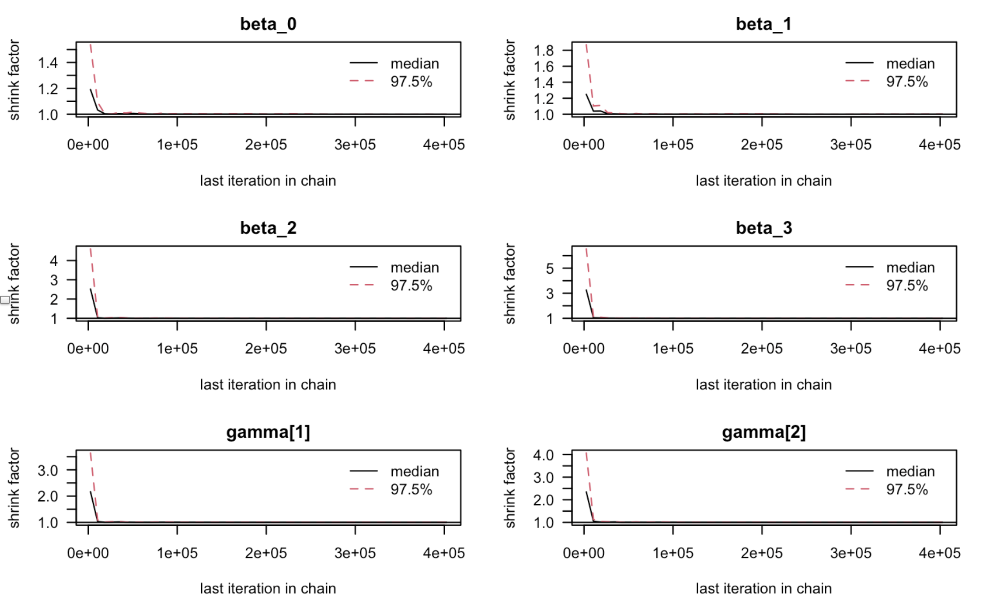
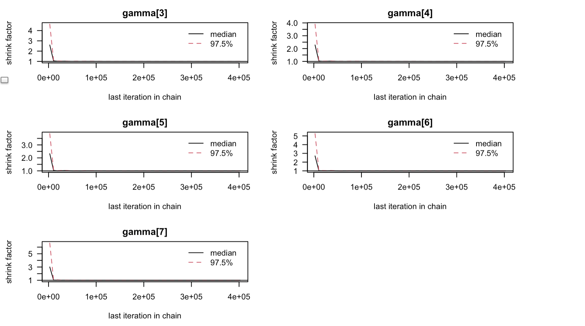
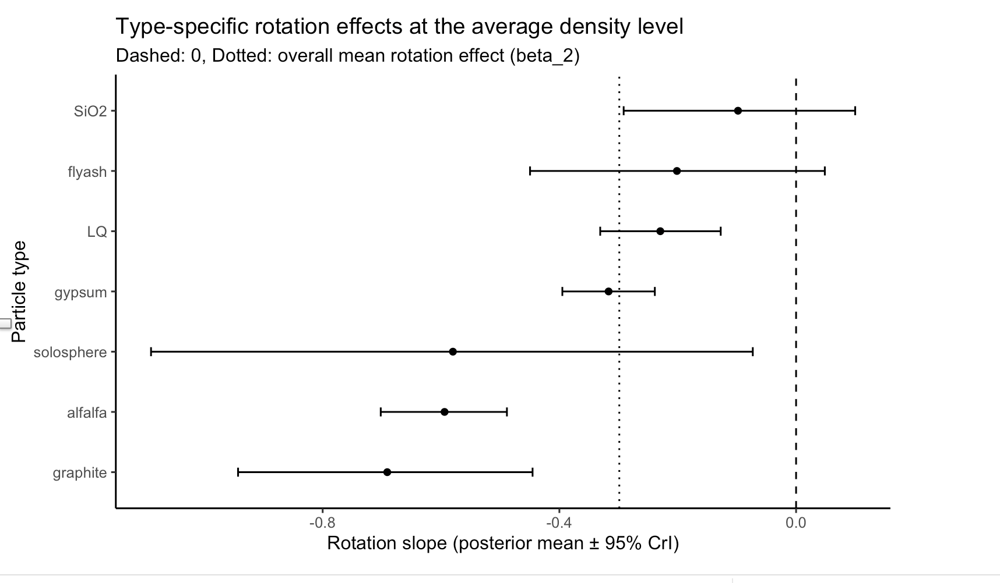

```{r, include=FALSE}
knitr::opts_chunk$set(
  echo = FALSE,
  message = FALSE,
  warning = FALSE,
  fig.width = 9,
  fig.height = 5
)

library(dplyr)
library(ggplot2)
library(lme4)
```


## Bayesian Hierarchical Model 

**Motivation:**
1. The model selection is based on the AIB/BIC results among a collection of candidate LMMs
2. We are interested in how the total  retained area depends on rotation, particle density and work of adhesion, and how particle type affects the slope of the rotation-area relationship
3. We adopt a Bayesian hierarchical framework to enable particle pooling across particle types and samples

**Model:**

$$
\begin{aligned}
y_{pij} &= \beta_0+ \beta_1\text{WOA}_p + (\beta_2 + \gamma_p) \text{rpm}_j + \beta_3(\text{rpm}_j\times \text{density}_p) + \mu_{i} +  + \epsilon_j 
\end{aligned}
$$

Here,

- $y_{pij}$ is the total area in (particle, sample) cell, 797 observations
- $\text{WOA}_p$ is the work of adhesion of particle type for type $p$
- $\text{rpm}_j$ is the rotation speed (RPM) for each observation $j$
- $\text{density}_p:$ the density of particle type 
- $\mu_{i}:$ is the (type, sample)-level random intercept for (particle, sample) cell
- $\gamma_{p}$ is the type-specific random slope representing the deviations from the mean rotation effect 
- All the continuous variables are standardized for a easier prior assumptions

---

## Prior Specification & MCMC Initializations

.pull-left[
*Prior Assumptions*

$$
\begin{aligned}
\beta_k &\sim \mathcal{N}(0,\sigma_\beta^2), \qquad k=0,1,2,3,\\
\mu_i &\sim \mathcal{N}(0,\sigma_\mu^2), \qquad i=1,\ldots,S,\\
\gamma_p &\sim \mathcal{N}(0,\sigma_\gamma^2), \qquad p=1,\ldots,P,\\
\sigma_\ell &\sim \text{half-}t(0,2.5), \qquad \ell\in\{\beta,\mu,\gamma\},\\
\varepsilon_{pij} &\sim \mathcal{N}(0,\sigma^2),\\
\sigma &\sim \text{half-}t(0,2.5).
\end{aligned}
$$


- The half-t distributions provides weak-informative and heavy-tailed for data-driven purpose.]

.pull-right[
*Initializations:*

$$
\begin{aligned}
\beta_k^{(0)} &\sim \mathcal{N}(0,1^2), \qquad k=0,1,2,3,\\
\mu_i^{(0)} &\sim \mathcal{N}(0,0.5^2), \qquad i=1,\ldots,S,\\
\gamma_p^{(0)} &\sim \mathcal{N}(0,1^2), \qquad p=1,\ldots,P,\\
\sigma,\sigma_\mu,\sigma_\beta,\sigma_\gamma &\sim \mathrm{Uniform}(0.2,2).
\end{aligned}
$$


- We use over-dispersed but reasonable initial values for all parameter in our 4 MCMC chains for a better MCMC convergence diagnostics. 
]

---

## MCMC Sampling Process

**Adaptive period:** 500 iterations

**Burn-in:** 2,000 iterations

**Sampling:** 400,000 iterations each chain with thinning = 1

**Rafery-Lewis Diagnostics for required sampling size:** Among all fixed association parameters, the model requires at least 336 burn-in and 371,424 iterations/chain, indicating our MCMC setting is adequate for analysis

**Effective Sample Size:**

| beta_0 (intercept) | beta_1 (WOA effect) | beta_2 (Mean Rotation Effect)| beta_3 (Rotation x Density Effect) |
|-------------------|----------|------------|---------|
| 14880.56   |11124.86  | 8479.041   |14048.96   |

| gamma_alfalfa | gamma_flyash | gamma_graphite | gamma_gypsum | gamma_LG | gamma_SiO2 | gamma_solos.|
|-------------------|----------|------------|---------|---------|---------|---------|
| 9061.02|  111179.984  | 11051.74    | 8868.77   | 9231.66     | 9833.28     | 11896.62    |


---

## Convergence Analysis

**Gelman-Rubin Factor:** Gelam-Rubin $\hat{R} = 1$ for all fixed effects and random slopes. 

**Gelman-Rubin Plots:**

.pull-left[

]

.pull-right[

]

- All shrink factor shrink to one quickly.  

---

## Inference 

**Posterior summary **(rounded to 0.01. Values shown are posterior means, 95% credible intervals, and posterior probabilities.)

.pull-left[
| Parameter | Mean | 2.5% | 97.5% | P(>0) | P(<0) |
|:--|--:|--:|--:|--:|--:|
| Intercept | 0.01 | -0.22 | 0.24 | 0.54 | 0.46 |
| WOA effect | 0.26 | 0.00 | 0.51 | 0.98 | 0.02 |
| Mean rotation effect | -0.30 | -0.56 | 0.02 | 0.03 | 0.97 |
| Rotation × density | -0.04 | -0.27 | 0.19 | 0.34 | 0.66 |
| Rot. for alfalfa | -0.59 | -0.70 | -0.49 | 0.00 | 1.00 |
| Rot. for flyash | -0.20 | -0.45 | 0.05 | 0.05 | 0.95 |
| Rot. for graphite | -0.69 | -0.94 | -0.45 | 0.00 | 1.00 |
| Rot. for gypsum | -0.32 | -0.39 | -0.24 | 0.00 | 1.00 |
| Rot. for LQ | -0.23 | -0.33 | -0.13 | 0.00 | 1.00 |
| Rot. for SiO₂ | -0.10 | -0.29 | 0.10 | 0.14 | 0.86 |

]

.pull-right[


Work of adhesion shows a robust positive effect, rotation tends to reduce retained area at the average level, but the magnitude and significance of this reduction varies substantially by particle type, while the rotation–density interaction appears weak.
]

---

## Conclusions

**Key inference**

- Work of adhesion has a **clear positive association** with retained area.
- Rotation **reduces retained area on average**, but the magnitude and significance of this effect **varies substantially by particle type**.
- The rotation–density interaction is **weak**, with posterior mass centered near zero.

**Limitations**

- Density effects are inferred indirectly through an interaction term and may be underestimated.
- The model focuses on linear effects and does not capture potential nonlinearities.
- Required number of sampling is large, leading to large computational cost.

**Future work**

- Explore more **nonlinear effects** of predictors.
- Allow different structured prior assumptions informed by material properties.
- Improving the computational efficiency.


